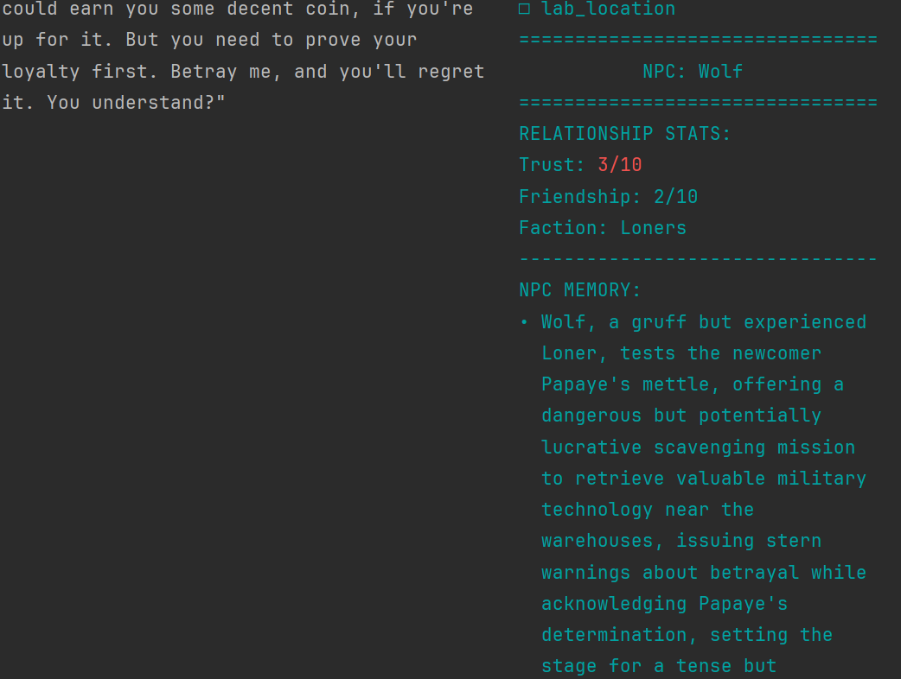

# S.T.A.L.K.E.R.: Shadows of Truth


*A text-based adventure showcasing next-generation dynamic NPCs with memory and relationship systems.*

## Overview

S.T.A.L.K.E.R.: Shadows of Truth is a proof-of-concept demonstrating how AI agents can create deeply responsive NPCs in narrative games. Set in the Chernobyl Exclusion Zone (inspired by the S.T.A.L.K.E.R. game series), you play as a stalker investigating the mysterious disappearance of Professor Kalancha, who was working on dangerous consciousness-transfer technology.

**Key Features:**
- NPCs with persistent memory of your interactions
- Dynamic relationship system that evolves based on conversations
- Real-time visualization of NPC memory and relationship changes
- Multi-path mystery that can be solved through different approaches

## Demo Version

This repository contains a minimal implementation designed to showcase the core concept: NPCs that remember interactions and develop relationships with the player. The demo features:

- A text-based interface with split-screen display
- 2 fully-implemented NPCs with memory and personality
- 4 explorable locations in the Zone
- Basic conversation and movement systems

### Screenshots



## Installation

### Prerequisites
- Python 3.8+
- OpenRouter API key (or other LLM API)

### Setup

1. Clone the repository:
```bash
git clone https://github.com/yourusername/stalker-memories.git
cd stalker-memories
```

2. Install dependencies:
```bash
pip install -r requirements.txt
```

3. Create a `.env` file in the project root:
```
OPENROUTER_API_KEY=your_api_key_here
```

4. Run the game:
```bash
python main.py
```

## How to Play

- Use `look` to examine your surroundings
- Use `talk [name]` to speak with NPCs (e.g., `talk Wolf`)
- Use `go [location]` to travel to connected areas (e.g., `go garbage`)
- Use `inventory` to check your items
- During conversations, type naturally to speak with NPCs
- Type `exit` or `bye` to end a conversation

## Future Vision

This demo represents just the beginning of our vision for dynamic NPCs in games. Our full concept includes:

### Scalable Agent Framework
- **Tiered NPC System**: Primary characters with full LLM capabilities, secondary NPCs with templated responses, and background NPCs with simple scripting
- **Graph-Based Relationships**: Social networks between NPCs so information and opinions propagate naturally
- **Event Broadcasting**: NPCs react to world events and player actions that would be perceptible to them

### Advanced Memory Systems
- **Hierarchical Memory**: Core personality, important episodic memories, and temporary recent memories
- **Vector Database Integration**: Efficient storage and retrieval of memories based on relevance
- **Memory Importance Ranking**: Algorithmic identification of which events are worth remembering

### Technical Optimizations
- **Cost-Efficient Processing**: Using smaller models, caching, and batched updates
- **Response Time Improvements**: Asynchronous processing and predictive pre-generation
- **Safety Mechanisms**: Multi-layered content filtering and character consistency validation

### Scale to Full Production
- **Developer Tooling**: No-code interfaces for creating NPCs and defining relationships
- **Cross-Game Persistence**: NPCs that remember players across different game sessions 
- **Multi-Modal Integration**: Voice, visual appearance, and emotional detection

## Architecture

The current implementation uses a simplified architecture:

```
┌─────────────────┐      ┌───────────────┐      ┌─────────────────┐
│                 │      │               │      │                 │
│  Game State     │◄────►│  Player       │◄────►│  UI Manager     │
│                 │      │               │      │                 │
└────────┬────────┘      └───────────────┘      └─────────────────┘
         │
         │
         ▼
┌────────────────────────────────┐      ┌─────────────────────────┐
│                                │      │                         │
│  NPC Agents                    │◄────►│  Memory Updater         │
│  - Static Traits               │      │                         │
│  - Dynamic State               │      └─────────────────────────┘
│  - Player Relationship         │
│  - Memory                      │
│                                │
└────────────────────────────────┘
```

## Contributing

This project is a proof of concept for [Hackathon/Research Project/etc.]. To contribute:

1. Fork the repository
2. Create a feature branch: `git checkout -b new-feature`
3. Commit your changes: `git commit -am 'Add new feature'`
4. Push to the branch: `git push origin new-feature`
5. Submit a pull request

## License

This project is licensed under the MIT License - see the LICENSE file for details.

## Acknowledgments

- Inspired by the S.T.A.L.K.E.R. game series by GSC Game World
- Built using Claude 3 and other LLM technologies
- Created for Tech of Tomorrow Hackathon

---

*Note: This project is not affiliated with GSC Game World or the official S.T.A.L.K.E.R. franchise. This is a fan project created for demonstration purposes only.*